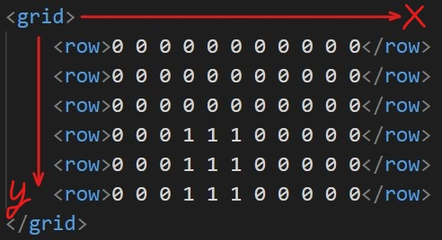
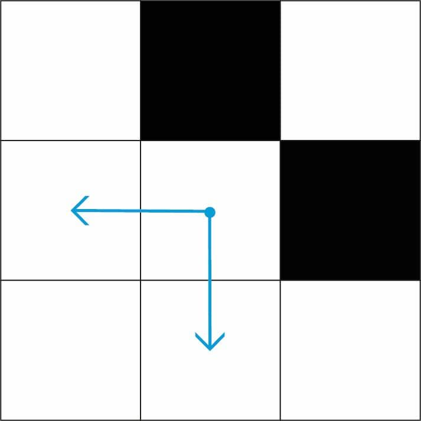
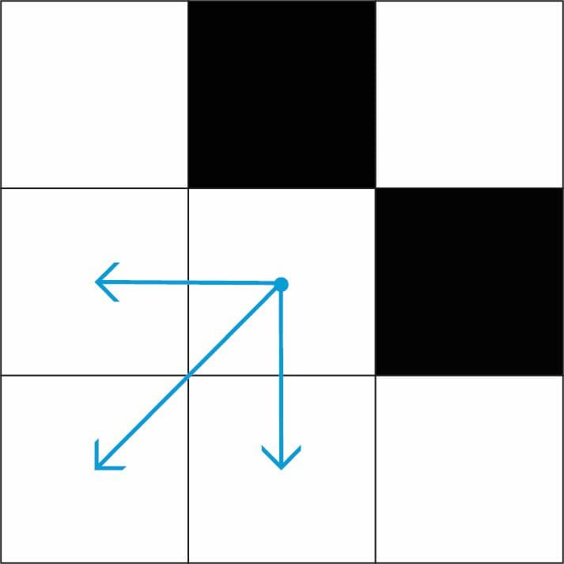
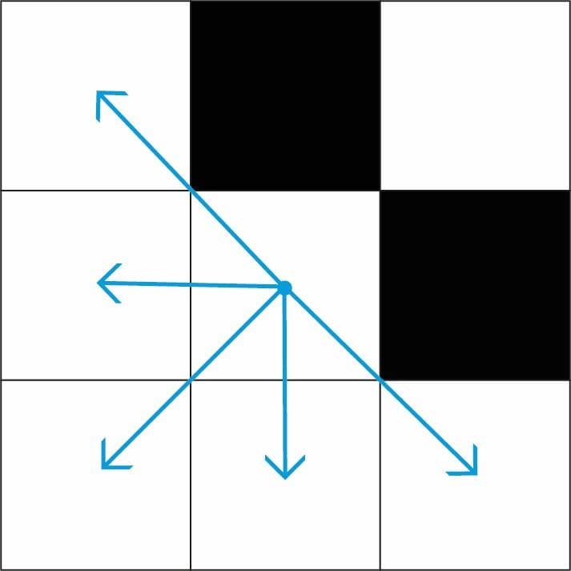
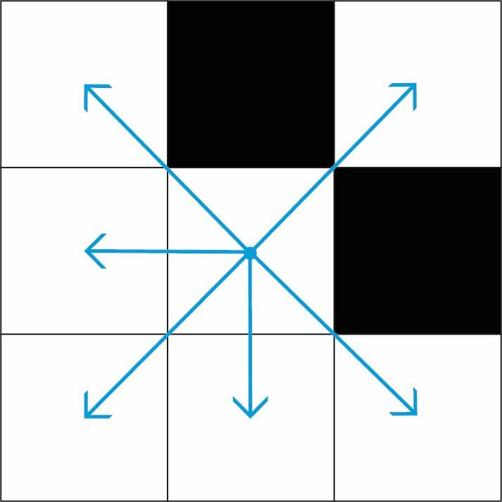
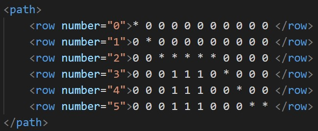

# PathPlanningProject
## Суть проекта
В рамках данного проекта планируется на `C++17` реализовать версии алгоритмов поиска путей на графах.

Весь функционал реализуется в виде консольного платформо-независимого приложения, 
которое можно собрать при помощи QMake или CMake.

На вход приложение принимает одним аргументом путь до XML файла определённой структуры. 
По завершении работы в директории с входным файлом создаётся другой XML файл, 
в котором описаны проделанные действия и результат поиска. 
Примеры входного и выходного файлов можно увидеть в папке [Examples](./Examples)

## Структура входного файла

Входной файл содержит в себе карту, точки старта и финиша, тип и настройки поиска.

##### Карта



##### Обозначения тегов

* `width` &mdash; количество столбцов
* `height` &mdash; количество строк
* `startx` &mdash; от 0 до width-1
* `starty` &mdash; от 0 до height-1
* `finishx` &mdash; от 0 до width-1
* `finishy` &mdash; от 0 до height-1

##### Поддерживаемые опции движения

* `allowdiagonal` &mdash; разрешено ли ходить по диагонали {true|false}. Если false, то
ходить можно только по горизонтали или вертикали
* `cutcorners` &mdash; разрешено ли ходить по диагонали, если рядом препятствие (аналогично)
* `allowsqueeze` &mdash; разрешено ли ходить по диагонали, если с обеих сторон препятствия (аналогично)

Параметры движения являются вложенными.  
Если `allowdiagonal` = false, то срезать углы и *просачиваться* - нельзя (несмотря на то, что стоит в `cutcorners`/`allowsqueeze`).  
Если `allowdiagonal` = true и `cutcorners` = false, то ходить по диагонали можно, срезать углы нельзя, *просачиваться* - нельзя (несмотря на то, что стоит в allowsqueeze).  
Если `allowdiagonal` = true и `cutcorners` = true, то ходить по диагонали можно, 
срезать углы можно, а можно *просачиваться* или нет - зависит от того, что стоит в теге `allowsqueeze`.

##### Пример

Стрелками обозначены клетки, куда можно перейти из центральной:

<p>
  <p = align="left">
    <br><br><br>
    allowdiagonal = false<br>
    cutcorners    = true/false<br>
    allowsqueeze  = true/false<br>
    <br><br><br>
  </p>
</p>
<br>
<p>
  <p = align="left">
    <br><br><br>
    allowdiagonal = true<br>
    cutcorners    = false<br>
    allowsqueeze  = true/false<br>
    <br><br><br>
  </p>
</p>
<br>
<p>
  <p = align="left">
    <br><br><br>
    allowdiagonal = true<br>
    cutcorners    = true<br>
    allowsqueeze  = false<br>
    <br><br><br>
  </p>
</p>
<br>
<p>
  <p = align="left">
    <br><br><br>
    allowdiagonal = true<br>
    cutcorners    = true<br>
    allowsqueeze  = true<br>
    <br><br><br>
  </p>
</p>

##### Поддерживаемые опции поиска (только для A*, для Дейкстры - не действуют)

* `metrictype` &mdash; эвристика для оценки расстояния
  > dx, dy &mdash; расстояние между двумя точками по осям x и y соответственно
  * `euclidean`: sqrt(dx * dx + dy * dy)
  * `manhattan`: dx + dy
  * `chebyshev`: max(dx, dy);
  * `diagonal`: abs(dx - dy) + sqrt(2) * min(dx, dy)
* `breakingties` &mdash; определяет порядок раскрытия вершин при равенстве f-значения: 
  * `g-min`
  * `g-max`
* `hweight` &mdash; вес эвристики при подсчете f-вершины (число >= 1). 
  * 1 &mdash; классический A*
  * \>1 &mdash; взвешенный A* (WA*). 
  > Взвешивание эвристики влечет за собой потерю оптимальности алгоритма.

## Структура выходного файла

Выходной файл дополнительно содержит:

##### Путь на карте

<br><br><br><br><br><br><br>

##### Лог движения в двух вариантах

- `lplevel`  &mdash; последовательно выведены клетки пути

- `hppath` &mdash; укороченный вариант, содержащий путь по частям, на которых движение выполнялось в одном направлении

##### Прочая информация о результатах работы

* `numberofsteps` &mdash; число шагов алгоритма (число раскрытий)
* `nodescreated` &mdash; число nodes, созданных за время поиска (|OPEN| + |CLOSED|)
* `length` &mdash;  длина пути (в клетках)
* `length_scaled` = length * cellsize
* `time` &mdash; время работы алгоритма в секундах (самого поиска, без ввода/вывода)

## Требования к ПО

### Linux
- Git 2.7.4 или выше
- CMake 3.2 или выше
- GCC 4.9 или выше
- Make

### Mac
- Git 2.23.0 или выше
- CMake 3.2 или выше
- Apple LLVM version 10.0.0 (clang-1000.11.45.5) или выше
- Make

### Windows
- Git 2.23.0 или выше
- CMake 3.2 или выше
- MinGW-w64 5.0.3 или выше (должен быть добавлен в переменную среды Path)

## Начало работы
### Скачивание
```bash
git clone https://github.com/kam3nskii/PathPlanningProject.git
```

### Сборка и запуск

Для сборки и запуска возможно использовать CMake или QMake.

CMakeLists.txt и .pro файлы доступны в репозитории. Ниже приведены скрипты сборки и запуска с использованием командной строки.

#### Linux и Mac
**Release** 
Сборка:
```bash
cd PathPlanningProject
cd Build
cd Release
cmake ../../ -DCMAKE_BUILD_TYPE="Release"
make
make install
```
Запуск:
```bash
cd ../../Bin/Release/
./Denis_Kamenskii_ASearch ../../Examples/example.xml
```

**Debug**
Сборка:
```bash
cd PathPlanningProject
cd Build
cd Debug
cmake ../../ -DCMAKE_BUILD_TYPE="Debug"
make
make install
```
Запуск:
```bash
cd ../../Bin/Debug/
./Denis_Kamenskii_ASearch ../../Examples/example.xml
```
#### Windows
**Release** 
Сборка:
```cmd
cd PathPlanningProject
cd Build
cd Release
set PATH
cmake ../../ -DCMAKE_BUILD_TYPE="Release" -G "MinGW Makefiles"
mingw32-make
mingw32-make install
```
Запуск:
```cmd
cd ../../Bin/Release/
Denis_Kamenskii_ASearch.exe ../../Examples/example.xml
```

**Debug**
Сборка:
```cmd
cd PathPlanningProject
cd Build
cd Debug
set PATH
cmake ../../ -DCMAKE_BUILD_TYPE="Debug" -G "MinGW Makefiles"
mingw32-make
mingw32-make install
```
Запуск:
```cmd
cd ../../Bin/Debug/
Denis_Kamenskii_ASearch.exe ../../Examples/example.xml
```

## Тестирование 
При использовании сборки CMake возможен запуск тестов.
Локальный запуск тестов производится из директории `.../PathPlanningProject/Build/{Debug|Release}/` с помощью команды:

```
 ctest
```

либо (для более подробного вывода):
```
 ctest --output-on-failure
```

## Мои контакты
**Каменский Денис**
- dekamenskiy@edu.hse.ru
- Telegram: @kam3nskii

## Контакты ментора
**Яковлев Константин Сергеевич**
- kyakovlev@hse.ru
- [Сайт НИУ ВШЭ](https://www.hse.ru/staff/yakovlev-ks)
- Telegram: @KonstantinYakovlev
