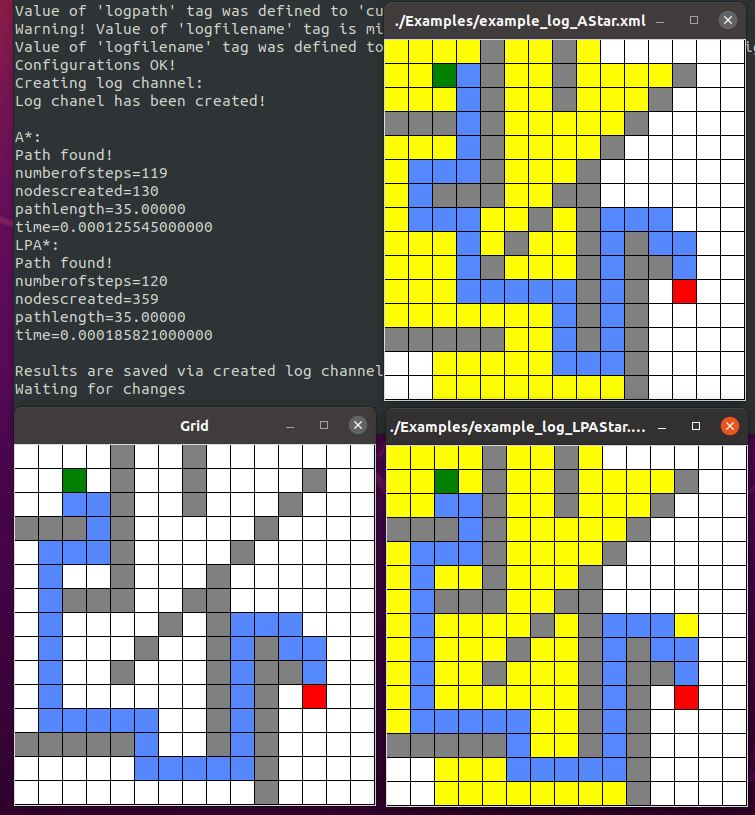
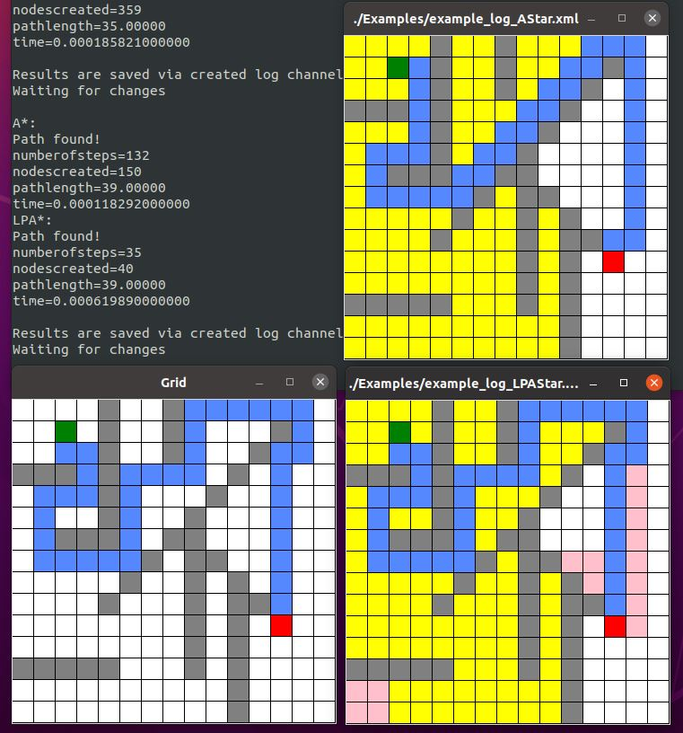

# PathPlanningProject
Linux test result:

[](https://travis-ci.com/kam3nskii/PathPlanningProject)

Windows test result:

[](https://ci.appveyor.com/project/kam3nskii/pathplanningproject/branch/master)

## Суть проекта
В данном репозитории представлен код изученных мной алгоритмов поиска путей на графах.

Весь функционал реализуется в виде написанного на `C++17` консольного платформо-независимого приложения, которое можно собрать при помощи `QMake` или `CMake`.

На вход программа принимает одним аргументом путь до XML файла определённой структуры. 
По завершении работы в директории с входным файлом создаются другие XML файлы, в которых описаны проделанные действия и результат поиска. 
Примеры входного и выходных файлов можно увидеть в папке [Examples](./Examples), а их структура описана [тут](#Files).

## Работа программы

### Скачивание

```bash
git clone https://github.com/kam3nskii/PathPlanningProject.git
```

### Сборка и запуск

Для сборки возможно использовать `CMake` или `QMake`.

`CMakeLists.txt` и `.pro` файлы доступны в репозитории. Ниже приведены скрипты сборки (`CMake`) и запуска с использованием командной строки.

Для сборки выберете необходимый вариант ниже, выполните описанные команды

#### Сборка

##### Linux и Mac

**Release** 
Сборка:

```bash
cd PathPlanningProject
cd Build
cd Release
cmake ../../ -DCMAKE_BUILD_TYPE="Release"
make
make install
```

Переход в директорию с исполняемым файлом:

```bash
cd ../../Bin/Release/
```

##### Windows

**Release** 
Сборка:

```cmd
cd PathPlanningProject
cd Build
cd Release
set PATH
cmake ../../ -DCMAKE_BUILD_TYPE="Release" -G "MinGW Makefiles"
mingw32-make
mingw32-make install
```

Переход в директорию с исполняемым файлом:

```cmd
cd ../../Bin/Release/
```

#### Запуск

Для запуска перейдите в указанную выше директорию с исполняемым файлом. Ниже описан процесс работы с программой, если входной файл находится в директории `.../PathPlanningProject/Examples/`

Непосредственно запуск:

```bash
./LPASearch ../../Examples/example.xml
```

После запуска на консоль будет выведен результат работы двух алгоритмов: A* и LPA\*. Затем в директории с входным файлом появятся файлы:

* `example_log_AStar.xm` &mdash; результат работы алгоритма A*
* `example_log_LPAStar.xml` &mdash; результат работы алгоритма LPA*
* `example_log_LPAStarTMP.xml` &mdash; файл с построенным LPA* путём, необходимый для визуализации карты во время взаимодействия с программой.

Все вышеперечисленные файлы можно виуализировать при помощи Python3 скриптов. Для этого откройте 3 новые вкладки терминала в корневой директории проекта `.../PathPlanningProject/`

Тогда выполнив в дувух из них команды:

```bash
python3 gridShow.py ./Examples/example_log_AStar.xml
```

и

```
python3 gridShow.py ./Examples/example_log_LPAStar.xml
```

можно будет увидеть карты соответствующих файлов, где:

* зелёная клетка &mdash; старт
* красная клетка &mdash; финиш
* белые клетки &mdash; проходимые клетки
* серые клетки &mdash; препятствия
* голубые клетки &mdash; кратчайший путь
* жёлтые клетки &mdash; проходимые клетки, которые были обработаны алгоритмом при первом запуске
* розовые клетки &mdash; проходимые клетки, которые были обработаны алгоритмом LPA* при повторных запусках (об этом далее)

Результат первого поиска:



После ознакомления с результатамии можно продолжить выполнение программы, которое будет заключаться в добавлении на карту непроходимых клеток. Будет доступно 5 описанных ниже итераций работы программы, после чего она завершится.

В третей вкладке терминала выполните:

```bash
python3 gridEdit.py ./Examples/example.xml
```

В графическом окне откроется карта, на которой голубым отмечен найденный путь. Необходимо левой кнопкой мыши нажать на одну из клеток, которую Вы желайте сделать непроходимой. Сразу после нажатия препятствие добавится в исходный входной файл, основная программа обработает его, перезапустит оба алгоритма, при этом A* будет работать "заново", а LPA* использует посчитанные на предыдущей итерации значения. После завершения поиска в окно терминала с запущенной основной программой будут выведены новые логи, выходные файлы перезапишутся. Для обновления картинок в окнах визуализаторов файлов необходимо на любую из клеток каждого из файлов нажать правой кнопкой мыши. После нажатия будет виден новый путь, а в окне LPA* розовым будут отмечены клетки, с которыми и только с которыми алгоритм взаимодействовал при повторных запусках, при этом жёлтые клетки остаются нетронутыми с самого первого запуска. 

Вывод после добавления препятствия на построенный в первый раз путь:



## <a name="Files"></a> Структура входного файла

Входной файл содержит в себе карту, точки старта и финиша, тип и настройки поиска.

##### Карта


##### Обозначения тегов

* `width` &mdash; количество столбцов
* `height` &mdash; количество строк
* `startx` &mdash; от 0 до width-1
* `starty` &mdash; от 0 до height-1
* `finishx` &mdash; от 0 до width-1
* `finishy` &mdash; от 0 до height-1

##### Поддерживаемые опции движения

* `allowdiagonal` &mdash; разрешено ли ходить по диагонали {true|false}. Если false, то
ходить можно только по горизонтали или вертикали
* `cutcorners` &mdash; разрешено ли ходить по диагонали, если рядом препятствие (аналогично)
* `allowsqueeze` &mdash; разрешено ли ходить по диагонали, если с обеих сторон препятствия (аналогично)

Параметры движения являются вложенными.  
Если `allowdiagonal` = false, то срезать углы и *просачиваться* - нельзя (несмотря на то, что стоит в `cutcorners`/`allowsqueeze`).  
Если `allowdiagonal` = true и `cutcorners` = false, то ходить по диагонали можно, срезать углы нельзя, *просачиваться* - нельзя (несмотря на то, что стоит в allowsqueeze).  
Если `allowdiagonal` = true и `cutcorners` = true, то ходить по диагонали можно, 
срезать углы можно, а можно *просачиваться* или нет - зависит от того, что стоит в теге `allowsqueeze`.

##### Пример

Стрелками обозначены клетки, куда можно перейти из центральной:

<p>
  <p = align="left">
    <br><br><br>
    allowdiagonal = false<br>
    cutcorners    = true/false<br>
    allowsqueeze  = true/false<br>
    <br><br><br>
  </p>
</p>
<br>
<p>
  <p = align="left">
    <br><br><br>
    allowdiagonal = true<br>
    cutcorners    = false<br>
    allowsqueeze  = true/false<br>
    <br><br><br>
  </p>
</p>
<br>
<p>
  <p = align="left">
    <br><br><br>
    allowdiagonal = true<br>
    cutcorners    = true<br>
    allowsqueeze  = false<br>
    <br><br><br>
  </p>
</p>
<br>
<p>
  <p = align="left">
    <br><br><br>
    allowdiagonal = true<br>
    cutcorners    = true<br>
    allowsqueeze  = true<br>
    <br><br><br>
  </p>
</p>

##### Поддерживаемые опции поиска (только для A\*/LPA\*, для Дейкстры - не действуют)

* `metrictype` &mdash; эвристика для оценки расстояния
  
  > dx, dy &mdash; расстояние между двумя точками по осям x и y соответственно
  * `euclidean`: sqrt(dx * dx + dy * dy)
  * `manhattan`: dx + dy
  * `chebyshev`: max(dx, dy);
  * `diagonal`: abs(dx - dy) + sqrt(2) * min(dx, dy)
* `breakingties` &mdash; определяет порядок раскрытия вершин при равенстве f-значения: 
  * `g-min`
  * `g-max`
* `hweight` &mdash; вес эвристики при подсчете f-вершины (число >= 1). 
  * 1 &mdash; классический A*
  * \>1 &mdash; взвешенный A* (WA*). 
  > Взвешивание эвристики влечет за собой потерю оптимальности алгоритма.

## Структура выходного файла

Выходной файл дополнительно содержит:

##### Путь на карте

<br><br><br><br><br><br><br>

##### Лог движения в двух вариантах

- `lplevel`  &mdash; последовательно выведены клетки пути

- `hppath` &mdash; укороченный вариант, содержащий путь по частям, на которых движение выполнялось в одном направлении

##### Прочая информация о результатах работы

* `numberofsteps` &mdash; число шагов алгоритма (число раскрытий)
* `nodescreated` &mdash; число nodes, созданных за время поиска (|OPEN| + |CLOSED|)
* `length` &mdash;  длина пути (в клетках)
* `length_scaled` = length * cellsize
* `time` &mdash; время работы алгоритма в секундах (самого поиска, без ввода/вывода)

## Требования к ПО

### Linux
- Git 2.7.4 или выше
- CMake 3.2 или выше
- GCC 7 или выше
- Make
- Python 3

### Mac
- Git 2.23.0 или выше
- CMake 3.2 или выше
- Apple LLVM version 10.0.0 (clang-1000.11.45.5) или выше
- Make
- Python 3

### Windows
- Git 2.23.0 или выше
- CMake 3.2 или выше
- MinGW-w64 5.0.3 или выше (должен быть добавлен в переменную среды Path)
- Python 3

## Тестирование 
При использовании сборки CMake возможен запуск тестов.
Локальный запуск тестов производится из директории `.../PathPlanningProject/Build/{Debug|Release}/` с помощью команды:

```
 ctest
```

либо (для более подробного вывода):
```
 ctest --output-on-failure
```

## Мои контакты
**Каменский Денис**
- dekamenskiy@edu.hse.ru
- Telegram: @kam3nskii

## Контакты ментора
**Яковлев Константин Сергеевич**
- kyakovlev@hse.ru
- [Сайт НИУ ВШЭ](https://www.hse.ru/staff/yakovlev-ks)
- Telegram: @KonstantinYakovlev
